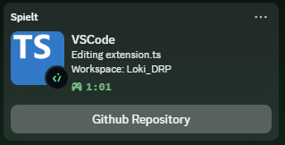

# Discord Rich Presence

This is a simple VSCode extension that updates your discord rich presence (activity) based on what you are doing in VSCode

## Features
* Show the current file you are editing
* Display an icon depending on the file type you are editing
* Show the workspace you opened
* Configure certain workspaces to be hidden

## Notes
This extension is highly personalized towards my needs and was not designed with the general public in mind.
If you still wish to use this extension as is, feel free to do so. Otherwise feel free to change the code to your needs and compile your own version.
